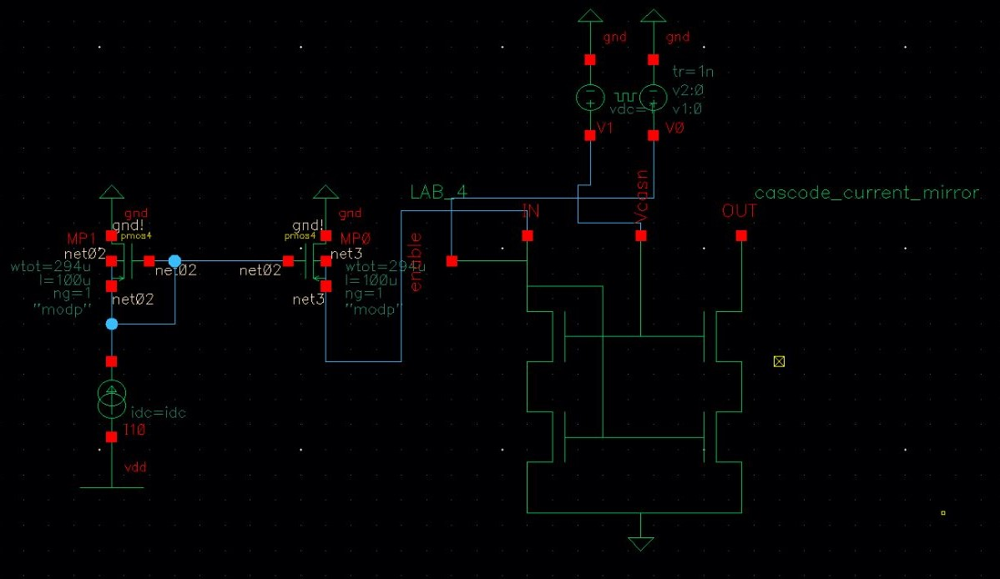

# Microelectronics Project Repository

Welcome to the Microelectronics Projects Repository! This repository contains several completed lab reports as part of a microelectronics course. I've used Cadence for the simulations.

- Turn-OFF/Power Down Circuit in Cadence.

Feel free to explore to gain insight into the basic concepts and techniques of microcircuit design! :)
